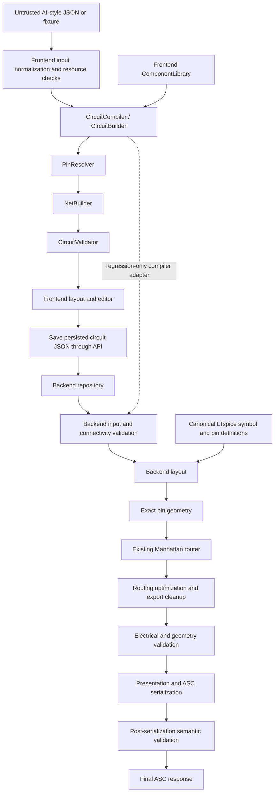

# Production pipeline and operating guide

Phase 10 strengthens the existing engines. It does not add simulation or a live AI provider. Measured evidence and acceptance limitations are recorded in [the Phase 10 report](../PHASE_10_PRODUCTION_REPORT.md); historical Phase 9 results are not current test evidence.

## Architecture and actual boundaries

See the [pipeline audit](PIPELINE_AUDIT.md) for subsystem findings, complexity, repeated work, memory risks, and remaining architectural boundaries.



The frontend compiler is **not** invoked by the production Python export endpoint. Production exports persisted source JSON; the regression/corpus adapter chains actual TypeScript compiler output into the backend for cross-language testing. The diagram deliberately distinguishes these paths.

| Responsibility | Implementation |
| --- | --- |
| Normalize untrusted input and instantiate components | `frontend/lib/circuit/engine/CircuitBuilder.ts` |
| Orchestrate compilation | `CircuitCompiler.ts` |
| Logical component metadata | `ComponentLibrary.ts`, `frontend/lib/circuit/library/` |
| Frontend physical pins | `PinResolver.ts` |
| Logical membership | `NetBuilder.ts`, backend `connectivity.py` |
| Electrical validation | `CircuitValidator.ts`, `connectivity.py`, `asc_validation.py` |
| Frontend display placement | `frontend/lib/circuit/layout/` |
| Export placement | backend `schematic_layout.py` |
| Native symbol coordinates and aliases | backend `pin_maps.py` |
| Wire paths and failure diagnostics | backend `routing/router.py`, `routing/geometry.py` |
| Geometry-only optimization | backend `routing/optimizer.py`, `export_cleanup.py` |
| Presentation and serialization | `export_presentation.py`, `ltspice_exporter.py` |
| Post-export record equivalence | `export_safety.py`, strict parser in `regression_validation.py` |
| Request-local budgets and telemetry | `production.py` |
| HTTP body protection | `request_limits.py` |

Frontend symbol coordinates and stock LTspice ASY coordinates are intentionally different. Canonical pin identities and electrical partitions must agree; display coordinates need not agree. Coordinates never determine source net membership. Optimization must preserve the already validated electrical partition.

## Supported components

The shared backend export library has six kinds:

| Kind | Native symbol | Canonical pins |
| --- | --- | --- |
| Resistor | `res` | `1`, `2` |
| Capacitor | `cap` | `1`, `2` |
| Diode | `diode` | `1` anode, `2` cathode |
| LED | `led` | `A`, `K` |
| BC547 / NPN | `npn` | `C`, `B`, `E` |
| NE555 | `Misc\NE555` | `1`–`8` |

An electrical label such as `GND`, `VCC`, or `VIN` is not a source component. Frontend library availability does not guarantee native export support. LM358, inductors, PNP transistors, MOSFETs, standalone ground, and voltage/current sources have no verified backend export definition in this phase and must fail rather than be substituted. A model name/value does not authorize a different electrical component family. Optional disconnected pins in existing fixtures remain disconnected; the exporter does not invent missing circuitry.

See [Adding components](ADDING_COMPONENTS.md).

## Size classes and configuration

Classes depend only on actual component count: **small 1–20**, **medium 21–100**, **large 101–500**, **extreme 501+**. Empty input is invalid; empty, missing, and invalid counts are reported as `unknown`, never as valid small circuits. Classification describes size, not guaranteed routability.

`PipelineLimits` in `backend/app/services/production.py` centralizes positive, finite backend budgets. Set environment variables with the `SPICECRAFT_` prefix and the uppercase field name, for example:

```powershell
$env:SPICECRAFT_MAX_COMPONENTS = '500'
$env:SPICECRAFT_ROUTING_SECONDS = '10'
$env:SPICECRAFT_TOTAL_SECONDS = '30'
```

Default request budgets:

| Resource | Default |
| --- | ---: |
| Components | 500 |
| Pins / nets | 4,000 each |
| Input wires | 10,000 |
| Routing segments | 20,000 |
| Layout iterations | 1,000,000 |
| Routing / optimization iterations | 2,000,000 each |
| Input / export bytes | 2,000,000 / 4,000,000 |
| Input items / depth | 100,000 / 32 |
| String length | 4,096 |
| Coordinate magnitude | 10,000,000 |
| Body upload / layout / routing / optimization | 10 / 5 / 10 / 5 seconds |
| Total backend pipeline | 30 seconds |

The existing `RoutingOptions` separately bounds individual compressed-grid searches and deterministic retries: 120,000 grid vertices, 80,000 expanded search states, four order attempts, three envelope margins. These are algorithm settings, not an alternative unbounded router.

Frontend input limits live together in `CIRCUIT_INPUT_LIMITS`; browser work must also stay bounded. The frontend and backend limits protect different representations and are not automatically synchronized. Changing deployment limits requires reviewing both boundaries and rerunning the corpus.

Timeout checks are cooperative at hot-loop/stage boundaries. They stop generation and prevent delivery of partial output; they are not hard operating-system preemption or a global concurrency limit. Use process/container memory and CPU limits, request admission/rate limiting, bounded worker counts, and reverse-proxy deadlines when deploying. Increasing limits is not evidence of increased capacity.

## Export transaction and failure handling

Export performs input validation, net building, validation, layout, exact pin resolution, routing, optimization, electrical validation, serialization, then serialized-record validation. `generate_asc` raises on fatal diagnostics. Diagnostic APIs may retain geometry for inspection but return empty ASC on failure. The HTTP endpoint returns attachment bytes only after the complete transaction succeeds.

Post-export checks compare component identity/count, symbols, values, anchors, orientation, exact wire multisets, electrical flag multisets, and pin positions to the validated representation. Native LTspice netlisting remains an independent test gate, not a subprocess run for every production export.

Diagnostic fields include `code`, `message`, `stage`, `circuit`, `component`, `pin`, and `net` when known. Preserve them in API clients rather than replacing them with a generic message.

| Condition | Behavior |
| --- | --- |
| Unknown electrical pin/component/symbol, ambiguous identity, invalid wire | Fatal validation; no routing/export |
| Unsupported component | Explicit unsupported-component diagnostic; no substitution |
| No collision-free required route | Routing diagnostic; no successful attachment |
| Stage/total timeout | Controlled timeout; no partial export |
| Missing optional presentation metadata | Existing documented defaults, without changing nets |
| Geometry cleanup | Only validated, topology-preserving changes |
| Unexpected exception | Generic safe client message; internal details retained in server logging |

Duplicate electrical identities are rejected when references are ambiguous; a potentially recoverable spelling conflict is not permission to guess endpoints. Missing wires may represent intentionally unwired components; explicit malformed connectivity is rejected.

The editor keeps a failed save's draft, shows diagnostic text, and supports explicit retry. Export is disabled while changes are unsaved or saving. Network requests are bounded and are not automatically replayed: a timed-out write may have completed on the server. Check saved state before retrying a write.

## Logging and debugging

The backend emits structured JSON pipeline events with circuit ID, size classification, component/pin/net/wire counts when available, per-stage milliseconds, total milliseconds, iteration counters, and warning/error counts. Standard Python logging supplies INFO/WARNING/ERROR/DEBUG levels. Normal pipeline events contain counts and timings, not full circuit JSON. Detailed diagnostics are available through errors and explicit debug logging. Failure events must remain visible; enabling production mode never disables electrical validation.

Production export does not invoke native screenshot capture, rendering, circuit-corpus discovery, visual analysis, or filesystem debug dumps. Debug/benchmark tools are explicit commands. Static symbol definitions and per-detector immutable pin corridors can be reused safely; whole mutable circuit/net/route state is request-local. No cross-request topology cache is introduced.

Timing overhead, profiling, native LTspice startup, image capture, and frontend process startup are different measurements. Read report definitions before comparing totals; per-stage parent/child timers may be inclusive and should not be summed blindly.

## Security and deployment limitations

Input boundaries reject excessive nesting, circular Python/JavaScript objects, nonfinite values, oversized collections/strings, invalid coordinates, malformed identifiers, unknown kinds, and multiline ASC attribute injection. HTTP body limits apply before framework JSON decoding. Repository updates use a temporary file in the existing source directory followed by atomic replacement; a request ID is not interpolated into a filesystem path. Circuit data is never passed to a shell command.

This hardening does not turn the current development deployment into a hosted multi-tenant service. Audit authentication/authorization of circuit routes, TLS, allowed origins, credential provisioning, rate limiting, concurrent export admission, worker isolation, and persistence ownership before exposing it publicly. Browser checks use isolated authentication and mocked transport, not live Firebase/production database acceptance. File-backed updates are atomic but do not provide optimistic concurrency control; concurrent edits can still overwrite each other.

## Testing and performance expectations

See [TESTING.md](../TESTING.md) for regression, corpus, native LTspice, browser, and stress commands. The Phase 10 report is the source for actual measured sizes, largest successful circuit, routing bottlenecks, peak traced Python allocation, and known failures. Small/medium responsiveness is a goal, not a guarantee for every topology. Large and extreme inputs must either complete correctly or return a bounded error. Failed corpus cases remain evidence, not cases to delete to improve a pass percentage.
